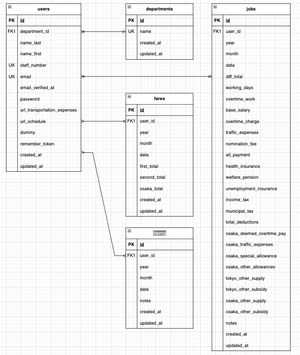

# 清掃会社向け基幹システム

## 概要

アナログで行っている勤怠・交通費・物品発注などの社内申請業務を Web 化するプロジェクト。  
全従業員を対象とし、3 ヶ月以内の導入を目指す。スマホ対応により出先からも申請可能。

## 設計書

本システムの設計書を下記に記載。詳細はリンク先を参照。

- [要件定義書](https://www.notion.so/26a4392ee6488008b5f2f6b2a1c5be1d)
- [基本設計書（画面設計、機能設計）](https://www.notion.so/2724392ee648800b8625dc9c7e9b8aa9#2784392ee64880ad9af1fde2a0c45f36)

## ER 図



## 環境構築

#### 開発環境起動の方法 ①（Dev Container）

本プロジェクトは VS Code Dev Containers を利用して、
Docker 上に統一された開発環境を構築できます。

ローカル環境に PHP・MySQL・Composer をインストールする必要はありません。

1. git から clone する

   ```bash
   git clone git@github.com:estra-inc/confirmation-test-contact-form.git

   ```

2. Docker Desktop を起動する

   必ず Docker Desktop を起動してから VS Code を開いてください。

3. プロジェクトを VS Code で開く

   ```bash
   File → Open Folder → プロジェクトルートを選択
   ```

4. Dev Container を起動する  
   VS Code 左下の緑色アイコン（><）をクリックし、

   ```bash
   Reopen in Container
   ```

   を選択します。

   VS Code が日本語化されている場合は、

   ```bash
   コンテナーで再度開く
   ```

   を選択します。

#### 開発環境起動の方法 ②（Docker ビルド）

##### ※Dev Container 利用の場合は操作不要

1. git から clone する

   ```bash
   git clone git@github.com:estra-inc/confirmation-test-contact-form.git

   ```

2. ターミナル上でコンテナを起動

   ```bash
   docker compose up -d --build

   ```

#### Laravel 環境構築

##### ※Dev Container 利用の場合は操作不要

3. php コンテナに接続

   ```bash
   docker compose exec php bash

   ```

4. php コンテナ内で下記を実行

   ```bash
   composer install

   ```

5. php コンテナ内でアプリケーションキーの作成

   ```bash
   php artisan key:generate

   ```

6. マイグレーションの実行

   ```bash
   php artisan migrate

   ```

7. シーディングの実行
   ```bash
   php artisan db:seed
   ```

### 使用技術(実行環境)

- PHP 8.2.10
- Laravel 9.52.21
- MySQL 8.1.0
- Apache 2.4.65

## URL

- 開発環境（管理者）：http://localhost:8000/admin/
- 開発環境（一般ユーザー）：http://localhost:8000/
- phpMyAdmin:：http://localhost:8081/

## デモユーザー

- 開発環境（管理者）：
  ```bash
  admin@example.co.jp
  password
  ```
- 開発環境（一般ユーザー）：
  ```bash
  teset@example.co.jp
  test
  ```

## 操作ガイド

1. 一般ユーザーでログインし、勤怠、交通費、物品発注のいずれかを入力
1. 管理者ユーザーでログインし、勤怠管理から一覧を表示
1. 該当の勤怠詳細から勤怠データの確認と Excel 勤怠のダウンロード
